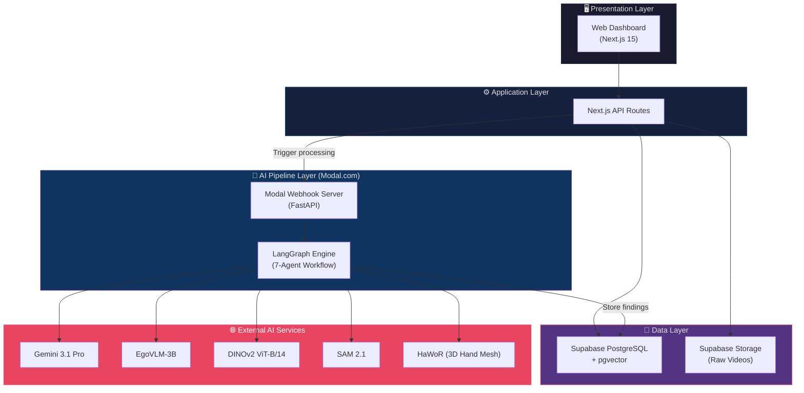
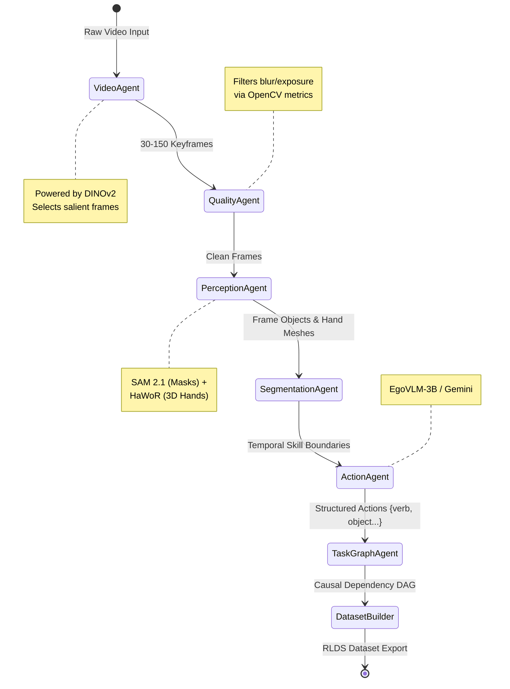
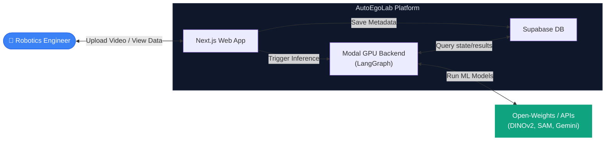

<div align="center">

# 🤖 AutoEgoLab 

### *Autonomous Egocentric Video to VLA Dataset Engine*

[](https://nextjs.org/)
[](https://langchain-ai.github.io/langgraph/)
[](https://modal.com)
[](https://supabase.com)
[](LICENSE)

**AutoEgoLab** is an automated pipeline that turns raw factory video into production-ready Vision-Language-Action (VLA) datasets in under a few minutes. It solves the biggest bottleneck in building general-purpose robots: the lack of high-quality demonstration data.

[Features](#-key-features) · [HLD](#-high-level-design-hld) · [LLD](#-low-level-design-lld) · [System Design](#-system-design) · [Setup](#-getting-started) · [Deployment](#-deployment)

</div>

---

## 🎯 The Problem

If you're building robots that learn from demonstration, you face a huge hurdle: getting data. Traditional methods are slow and expensive, and zero-shot learning requires quality data for fine-tuning.

| Method | Cost | Time | Limitations |
|--------|------|------|-------------|
| **Human Teleoperation** | $150-300/hour | 30-60 min/task | Slow, hardware-dependent, physically exhausting |
| **Kinesthetic Teaching** | High hardware cost | 30-60 min/task | Fails on complex dexterous tasks |
| **Manual Annotation** | $10-30/frame | Weeks | Subjective, doesn't scale, soul-crushing |

General-purpose robots need millions of demonstrations. At $20/frame, the math simply doesn't work. 

## 💡 The Solution

You already have hours of footage of workers performing tasks. What if you could convert that existing video into structured, robot-trainable data automatically?

**AutoEgoLab** converts raw, egocentric factory video into structured VLA datasets automatically. In minutes, replacing weeks of annotation, you get skill segments, structured action labels, object masks, and hierarchical task graphs exported into RLDS format.

---

## ✨ Key Features

### 🚀 Zero-to-Dataset in Minutes
- Process raw egocentric video into VLA datasets in **2-5 minutes**.
- Serverless auto-scaling architecture keeps costs low (~$0.26 per video).

### 🤖 7-Agent AI Pipeline
- **Video & Quality Agents**: Select optimal keyframes, filter blur and bad exposure.
- **Perception Agent**: Extracts objects, tracking masks with SAM 2.1, and 3D hand poses with MANO models (HaWoR).
- **Segmentation Agent**: Accurately bounds skills in time.
- **Action Agent**: Provides structured `{verb, object, tool, target}` labels via EgoVLM-3B / Gemini.
- **Task Graph Agent**: Analyzes hierarchical, causal task dependencies.
- **Dataset Builder**: Exports directly to RLDS format for OpenVLA, RT-X, or π0.

### 📊 Comprehensive Insights
- **Object Tracking**: Pixel-level masks with temporal consistency.
- **Hand Pose Estimation**: Full 3D mesh via parametric models.
- **Action Labels**: Instead of free-text, structured verbs, objects, and tools.
- **Task Structure**: Hierarchical DAG representations of the demonstrated task.

### 🌐 Cloud-Native Stack
- Next.js 15 for a sleek web interface
- LangGraph orchestration
- Supabase for relational data
- Modal.com for serverless GPU compute

---

## 🏛️ High-Level Design (HLD)

The platform leverages a microservices-inspired workflow bridging the web UI, the backend orchestration, and cutting-edge vision models running on serverless GPUs.



---

## 🔧 Low-Level Design (LLD)

### LLD 1 — The 7-Agent Dataset Generation Pipeline (LangGraph)

The core mechanism for processing video is a state graph containing our specialized agents.



---

## 🏗️ System Design

### System Context Diagram



---

## 🛠️ Tech Stack

| Component | Technology | Purpose |
|-----------|-----------|---------|
| **AI Orchestration** | LangGraph | Stateful, edge-based execution of agent workflow |
| **GPU Compute** | Modal | Serverless GPU scaling with fast cold starts |
| **Vision Models** | DINOv2, SAM 2.1 | Zero-shot image semantic extraction & temporal masking |
| **Full Stack Framework** | Next.js 15 | Robust frontend and API route handling |
| **Database** | Supabase (PostgreSQL) | Metadata, run results, and blob storage |
| **VLM Services** | Google Gemini / EgoVLM | Action reasoning and DAG generation |
| **Dataset Format** | TFRecord / JSON / RLDS| Standardized export for OpenVLA/RT-X training |

---

## 💰 ROI / Performance

By utilizing this tool, a typical robotics startup can realize massive savings:

| Cost Factor | Traditional Methods | AutoEgoLab |
|-------------|-------------|----------------------|
| **1,000 demonstrations** | $45,000-90,000 (teleop) | ~$260 + your time |
| **Annotation team** | $200K/year (3 FTEs) | $0 |
| **Dataset iteration** | 2-3 weeks/iteration | Hours |
| **Scale to 10K demos** | $450K-900K | ~$2,600 |

---

## 🚀 Getting Started

### Prerequisites
- Node.js & npm
- Python 3.10+
- Accounts on Supabase and Modal

### Installation

```bash
# Clone the repository
git clone https://github.com/jaiswal-naman/autoegolab.git
cd autoegolab

# Install frontend dependencies
npm install

# Setup environment variables
cp .env.example .env.local
# Fill in: SUPABASE_URL, SUPABASE_ANON_KEY, MODAL_TOKEN_ID, MODAL_TOKEN_SECRET, GEMINI_API_KEY
```

### Run Locally

```bash
# Start the Next.js development server
npm run dev
```

---

## 🐳 Deployment

### Frontend (Vercel)

```bash
vercel deploy
```

### GPU Backend (Modal)

```bash
cd modal_backend
modal deploy app.py
```

---

## 🔮 Future Roadmap

- [ ] Multi-camera / static camera support
- [ ] Robot policy integration (ALOHA, RT-X)
- [ ] Fleet ingestion for batch processing
- [ ] Active learning loop for quality improvement
- [ ] Direct export to HuggingFace Dataset Hub

---

## 📄 License

This project is licensed under the MIT License — see the [LICENSE](LICENSE) file for details.

---

<div align="center">

**Built by [Naman Jaiswal](https://github.com/jaiswal-naman)**

*AutoEgoLab — Let the machines build the data. You build the future.*

</div>
