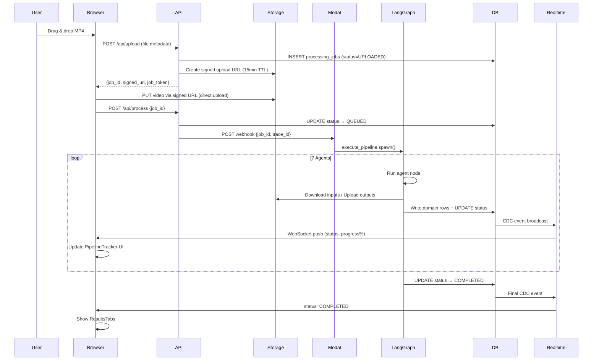
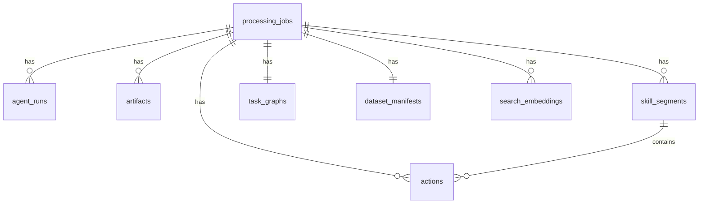

# AutoEgoLab

<p align="center">
  
  
  
</p>

<p align="center">
  <strong>Automate the conversion of egocentric factory video into robot-trainable VLA datasets</strong>
</p>

---

## 📋 Table of Contents

- [The Problem](#the-problem)
- [Solution Overview](#solution-overview)
- [Architecture](#architecture)
- [The 7-Agent Pipeline](#the-7-agent-pipeline)
- [Models & Technologies](#models--technologies)
- [System Design](#system-design)
- [Data Flow](#data-flow)
- [Database Schema](#database-schema)
- [Fault Tolerance](#fault-tolerance)
- [Getting Started](#getting-started)
- [API Reference](#api-reference)

---

## The Problem

Building robot training data today requires one of three expensive approaches:

| Method | Cost | Time per Task | Limitations |
|--------|------|---------------|-------------|
| **Human Teleoperation** | $150-300/hr | 30-60 min | Slow, physically constrained to hardware |
| **Kinesthetic Teaching** | High hardware cost | 30-60 min | Fails on complex dexterous tasks |
| **Manual Frame Annotation** | $10-30/frame | Weeks | Subjective, doesn't scale |

**The core bottleneck:** All approaches scale linearly with human time. Robot training datasets remain tiny, expensive, and slow to create—why general-purpose robots still can't generalize across tasks.

### Why Existing Approaches Fail

- **Monolithic VLMs (GPT-4V, Gemini):** Output text only, no pixel masks, no hand tracking, hallucinate action sequences
- **Single-step annotation pipelines:** No failure isolation, no retry semantics, unstructured output
- **Offline batch systems:** No real-time visibility, not suitable for demos

---

## Solution Overview

AutoEgoLab takes a raw egocentric factory video and produces a complete **VLA (Vision-Language-Action) training dataset** in under 5 minutes—with zero human annotation.

```
Input: Raw MP4 Video (egocentric, factory)
         │
         ▼
    ┌─────────────────────────────────────────────┐
    │     7-Agent AI Pipeline (LangGraph)         │
    └─────────────────────────────────────────────┘
         │
         ▼
Output: VLA Dataset (JSON + RLDS format)
        ├── Skill segments with timestamps
        ├── Structured action labels (verb, object, tool, target)
        ├── Hierarchical task graph (DAG)
        └── Pixel-precise object masks + 3D hand meshes
```

### Key Differentiators

| Dimension | Existing | AutoEgoLab |
|-----------|----------|------------|
| **Annotation** | Manual / VLM hallucination | 7-agent automated pipeline |
| **Object Tracking** | 2D bounding boxes | Pixel-level masks (SAM 2.1) with temporal tracking |
| **Hand Pose** | None or 2D keypoints | Full 3D mesh via MANO parametric model (HaWoR) |
| **Action Labels** | Free-text VLM output | Structured `{verb, object, tool, target}` with confidence |
| **Task Structure** | Flat list | Hierarchical DAG (subtask groupings + causal edges) |
| **Speed** | Hours/days | ~2-5 minutes |
| **Scalability** | Linear with humans | Serverless GPU auto-scaling on Modal |

---

## Architecture

### High-Level System Diagram

```
┌─────────────────────────────────────────────────────────────────────────────────┐
│                              AUTOEGOLAB ARCHITECTURE                             │
├─────────────────────────────────────────────────────────────────────────────────┤
│                                                                                 │
│   ┌──────────┐     ┌──────────────┐     ┌─────────────┐     ┌──────────────┐  │
│   │  Browser │────▶│  Next.js API  │────▶│   Modal.com │────▶│  Supabase    │  │
│   │   (UI)   │     │  (Vercel)     │     │ (GPU Compute)│     │ (DB + Storage)│  │
│   └────┬─────┘     └──────┬───────┘     └──────┬──────┘     └──────┬───────┘  │
│        │                  │                    │                   │          │
│        │           ┌──────▼───────┐     ┌──────▼──────┐    ┌──────▼───────┐  │
│        │           │  Upload      │     │ LangGraph   │    │   PostgreSQL │  │
│        │           │  Trigger     │     │ Pipeline    │    │   + pgvector │  │
│        │           │  Webhook     │     │ (7 Agents)  │    │   + Realtime │  │
│        │           └──────────────┘     └─────────────┘    └──────────────┘  │
│        │                                                         │             │
│        │            ┌──────────────────────────────────────────┘             │
│        │            │  Supabase Realtime (WebSocket)                          │
│        │            │  Pushes job status updates to browser                   │
│        │            └─────────────────────────────────────────────────────────┤
│        │                                                                     │
│   ┌────▼─────────────────────────────────────────────────────────────────────┐  │
│   │                        EXTERNAL SERVICES                                │  │
│   │  ┌─────────────┐  ┌──────────────┐  ┌──────────────┐  ┌────────────┐   │  │
│   │  │ Gemini 3.1  │  │  LangSmith   │  │   Upstash    │  │   DINOv2   │   │  │
│   │  │  Pro API    │  │  (Tracing)   │  │    Redis     │  │  (Cached)  │   │  │
│   │  └─────────────┘  └──────────────┘  └──────────────┘  └────────────┘   │  │
│   └────────────────────────────────────────────────────────────────────────────┘  │
└──────────────────────────────────────────────────────────────────────────────────┘
```

### 6-Layer Architecture

| Layer | Technology | Purpose |
|-------|------------|---------|
| **Frontend** | Next.js 15 App Router | SaaS dashboard, upload zone, pipeline tracker, results viewer |
| **API Gateway** | Vercel Serverless | REST endpoints, rate limiting (Upstash Redis), auth validation |
| **AI Compute** | Modal.com | Serverless GPU execution, LangGraph orchestration, 7 AI agents |
| **Object Storage** | Supabase Storage | 5 buckets for raw videos, frames, intermediates, datasets |
| **Database** | Supabase PostgreSQL | 8 tables, pgvector for semantic search, RLS security |
| **Realtime** | Supabase CDC | WebSocket push for job status updates |

---

## The 7-Agent Pipeline

The pipeline follows the **Information Pyramid**—each stage compresses data while enriching semantic depth:

```
Raw Video (gigabytes)
        │
   [Video Agent] ────▶ DINOv2 embeddings + K-Medoids clustering
        │            300 frames → ~30-150 keyframes
        │
   [Quality Agent] ─▶ Laplacian variance + brightness filters
        │            ~150 frames → ~120 clean frames
        │
   [Perception] ────▶ Parallel: YOLOE + SAM 2.1 + HaWoR
        │            Pixels → objects + masks + hand poses
        │
   [Segmentation] ─▶ Jaccard distance + contact signals
        │            Continuous stream → discrete skill segments
        │
   [Action Agent] ─▶ EgoVLM-3B (fallback: Gemini)
        │            Skill clips → semantic action labels
        │
   [Task Graph] ───▶ Gemini 3.1 Pro with deep thinking
        │            Action sequence → hierarchical DAG
        │
   [Dataset Builder]─▶ Pydantic validation + RLDS export
        │
VLA Dataset (kilobytes)
```

### Agent Details

| # | Agent | Model | GPU | Runtime (p50) | Output |
|---|-------|-------|-----|---------------|--------|
| 1 | **Video Agent** | DINOv2 ViT-B/14 | T4 | 12s | ~30-150 keyframe artifacts |
| 2 | **Quality Agent** | OpenCV (CPU) | CPU | 4s | Clean frame artifact IDs |
| 3 | **Perception Agent** | YOLOE + SAM 2.1 + HaWoR | T4/A10G | 40s | Merged perception JSON |
| 4 | **Segmentation Agent** | Signal processing (CPU) | CPU | 8s | Skill segment IDs |
| 5 | **Action Agent** | EgoVLM-3B (fallback: Gemini) | A10G | 28s | Action record IDs |
| 6 | **Task Graph Agent** | Gemini 3.1 Pro | API | 18s | Task graph ID |
| 7 | **Dataset Builder** | Pydantic + TFRecord | CPU | 4s | Dataset manifest ID |

### Parallel Perception Stage

```
                    ┌─────────────────┐
                    │ perception_prepare │
                    └────────┬────────┘
                             │
           ┌─────────────────┼─────────────────┐
           │                 │                 │
    ┌──────▼──────┐   ┌─────▼─────┐   ┌──────▼──────┐
    │   Object    │   │   Mask    │   │    Hand     │
    │   Branch    │   │   Branch  │   │   Branch    │
    │   YOLOE     │   │  SAM 2.1  │   │   HaWoR      │
    │   (T4)      │   │   (T4)    │   │   (A10G)     │
    └──────┬──────┘   └─────┬─────┘   └──────┬──────┘
           │                │                │
           └────────────────┼────────────────┘
                            │
                     ┌──────▼──────┐
                     │ perception_merge │
                     │ (contact heuristic)│
                     └──────────────┘
```

**Why parallel?** All three branches receive the same `clean_frame_artifact_ids[]` as input and produce independent outputs. LangGraph's fan-out/fan-in guarantees the merge node only runs after all three complete—reducing wall-clock time by ~40%.

---

## Models & Technologies

### Computer Vision Models

| Model | Purpose | Why This Choice |
|-------|---------|-----------------|
| **DINOv2 ViT-B/14** | Visual embeddings for keyframe selection | Self-supervised—learns structural semantics without classification bias. K-Medoids in 768-dim space selects maximally diverse frames. |
| **YOLOE-26x-seg** | Object detection + segmentation | Anchor-free, real-time on T4. Outputs both bounding boxes AND pixel masks for contact detection. |
| **SAM 2.1** | Video segmentation with temporal tracking | Memory bank mechanism maintains mask identity across occlusions—critical for consistent object tracking. |
| **HaWoR** | 3D hand mesh reconstruction | Egocentric-specific, uses MANO parametric model. Outputs 51-dim pose + 3D fingertips—directly actionable for robot grippers. |
| **EgoVLM-3B** | Egocentric action recognition | Fine-tuned on Ego4D dataset—understands factory-specific action taxonomy. Falls back to Gemini for low-confidence predictions. |

### Infrastructure Technologies

| Technology | Purpose | Justification |
|------------|---------|----------------|
| **LangGraph 0.3** | Pipeline orchestration | Stateful multi-agent workflows with typed state, fan-out/fan-in, and checkpointing. Celery lacks stateful branching; Airflow is designed for batch ETL. |
| **Modal.com** | Serverless GPU compute | <3s warm start with pre-cached model images. Fractional GPU billing—no paying for idle cluster time. |
| **Supabase** | Database + Storage + Realtime | PostgreSQL with pgvector for semantic search, built-in CDC for realtime updates, RLS for security. |
| **Next.js 15** | Frontend framework | App Router, Vercel-native, API routes built-in, SSR for SEO. |
| **Upstash Redis** | Rate limiting | Serverless Redis with HTTP API—sliding window counters for API protection. |

---

## System Design

### Pipeline State Flow

```python
class PipelineState(TypedDict):
    job_id: str                           # UUID
    trace_id: str                         # LangSmith trace ID
    video_artifact_id: str               # Raw MP4 in storage
    raw_frame_artifact_ids: List[str]    # Extracted keyframes
    clean_frame_artifact_ids: List[str]  # After quality filter
    perception_artifact_id: str          # Merged object+mask+hand
    segment_ids: List[str]               # Skill boundaries
    action_ids: List[str]                # Action labels
    task_graph_id: str                   # Hierarchical DAG
    dataset_manifest_id: str            # Final output reference
    error: Optional[str]                 # Failure reason if any
```

**Critical Design Rule:** Agents NEVER pass raw image bytes through state—only UUID artifact references. This keeps serialized state under 1KB regardless of video length.

### Job State Machine (FSM)

```
    ┌──────────┐      ┌────────┐      ┌──────────────────────┐
    │ UPLOADED │─────▶│ QUEUED │─────▶│ VIDEO_AGENT_RUNNING │
    └──────────┘      └────────┘      └──────────┬───────────┘
                                                 │
                    ┌────────────────────────────┼────────────────────────────┐
                    │                            │                            │
             ┌──────▼──────┐             ┌──────▼──────┐             ┌──────▼──────┐
             │ QUALITY_    │             │ PERCEPTION_ │             │ SEGMENT_    │
             │ AGENT_RUN   │             │ AGENT_RUN   │             │ AGENT_RUN   │
             └──────┬──────┘             └──────┬──────┘             └──────┬──────┘
                    │                            │                            │
             ┌──────▼──────┐             ┌──────▼──────┐             ┌──────▼──────┐
             │ ACTION_     │────────────▶│ TASK_GRAPH_│────────────▶│ DATASET_    │
             │ AGENT_RUN   │             │ AGENT_RUN   │             │ BUILDER_RUN │
             └──────┬──────┘             └──────┬──────┘             └──────┬──────┘
                    │                            │                            │
                    └────────────────────────────┼────────────────────────────┘
                                                 │
                                          ┌──────▼──────┐
                                          │  COMPLETED   │
                                          └─────────────┘
```

### Complete Data Flow



---

## Database Schema

### Entity Relationship Diagram



### Key Tables

| Table | Purpose |
|-------|---------|
| `processing_jobs` | Job FSM, status, progress, failure details |
| `agent_runs` | Per-agent metrics, trace URLs, retry counts |
| `artifacts` | Storage references (bucket, object_key) |
| `skill_segments` | Timestamped skill boundaries with confidence |
| `actions` | Structured action labels `{verb, object, tool, target}` |
| `task_graphs` | Hierarchical DAG with nodes and edges |
| `dataset_manifests` | Final output metadata + download URLs |
| `search_embeddings` | pgvector 768-dim embeddings for semantic search |

### Key Design Decisions

- **RLS (Row Level Security):** All tables have `deny_all` policies. All access goes through `service_role` key (server-side only).
- **pgvector:** `search_embeddings` uses IVFFlat index for cosine similarity search.
- **Realtime publication:** `processing_jobs`, `agent_runs` published to Supabase Realtime for live UI updates.

---

## Fault Tolerance

### Retry Strategy (Tenacity)

```python
@retry(
    stop=stop_after_attempt(3),
    wait=wait_exponential(multiplier=2, min=2, max=30),
    retry=retry_if_exception_type((NetworkError, Supabase503, Gemini429, CUDAOOMError))
)
def call_model():
    ...
```

- **Exponential backoff:** 2s → 4s → 8s (capped at 30s)
- **Selective retry:** Network errors retry; bad input data fails immediately
- **CUDA OOM recovery:** Halves batch size and retries on OOM

### Heartbeat Watchdog

A scheduled Modal function runs every 60s to detect "stuck" jobs:
- Jobs with no `updated_at` change for 180s are flagged
- Attempts resume from last checkpoint
- If no checkpoint, marks as `FAILED_ORCHESTRATOR`

### Checkpoint-Based Recovery

Each agent writes checkpoint data before transitioning status:
```json
{
  "checkpoints": {
    "video_agent": {"artifact_ids": ["uuid1", "uuid2"]},
    "quality_agent": {"artifact_ids": ["uuid3", "uuid4"]},
    "perception_agent": null
  }
}
```

On resume: `build_resume_state()` reconstructs PipelineState and resumes from the failed stage.

### Edge Cases

| Scenario | Detection | Response |
|----------|------------|----------|
| Video all dark | Quality Agent: brightness < 20 | `FAILED_QUALITY_AGENT` |
| Hands occluded >60% | HaWoR: few detections | Degraded mode (mask-delta only) |
| No objects detected | YOLOE: zero detections | One FALLBACK segment |
| VLM low confidence | EgoVLM < 0.40 | Gemini 3.1 fallback |
| SAM OOM | CUDA OOM | Halve batch size, retry |
| Gemini bad JSON | instructor parse fails | Template graph fallback |
| Browser disconnects | — | Re-fetch status on reconnect |

---

## Getting Started

### Prerequisites

- Node.js 20+
- Python 3.11+
- Supabase account
- Modal account
- Google Gemini API key

### Installation

```bash
# Clone repository
git clone https://github.com/jaiswal-naman/autoegolab.git
cd autoegolab

# Install frontend dependencies
npm install

# Set up environment variables
cp .env.example .env.local
# Fill in: SUPABASE_URL, SUPABASE_ANON_KEY, MODAL_WEBHOOK_SECRET, GEMINI_API_KEY
```

### Development

```bash
# Run Next.js development server
npm run dev

# Open http://localhost:3000
```

### Deployment

```bash
# Deploy to Vercel
vercel deploy

# Deploy AI pipeline to Modal
cd modal_backend
modal deploy app.py
```

---

## API Reference

| Endpoint | Method | Description |
|----------|--------|-------------|
| `/api/upload` | POST | Initialize job, get signed upload URL |
| `/api/process` | POST | Trigger Modal pipeline |
| `/api/job/:id` | GET | Get job status and details |
| `/api/search` | POST | Semantic search via pgvector |
| `/api/job/:id/dataset` | GET | Get dataset download URLs |
| `/api/job/:id/task-graph` | GET | Get task graph JSON |

---

## Estimated Runtime

| Stage | Time (p50) | Time (p95) |
|-------|------------|------------|
| Video Agent | 12s | 25s |
| Quality Agent | 4s | 8s |
| Perception (parallel) | 40s | 75s |
| Segmentation Agent | 8s | 15s |
| Action Agent | 28s | 60s |
| Task Graph Agent | 18s | 40s |
| Dataset Builder | 4s | 8s |
| **TOTAL** | **~120s** | **~300s** |

---

## Future Extensions

- Multi-camera support
- Robot policy integration (ALOHA, RT-X)
- Fleet ingestion for batch processing
- Active learning for quality improvement

---

## License

MIT License - See [LICENSE](LICENSE) for details.

---

<p align="center">
  <sub>Built with Next.js, LangGraph, Modal, and Supabase</sub>
</p>