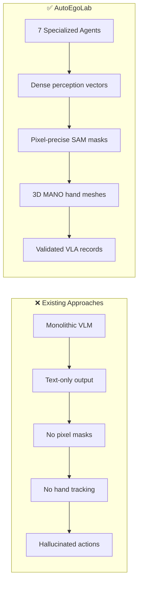
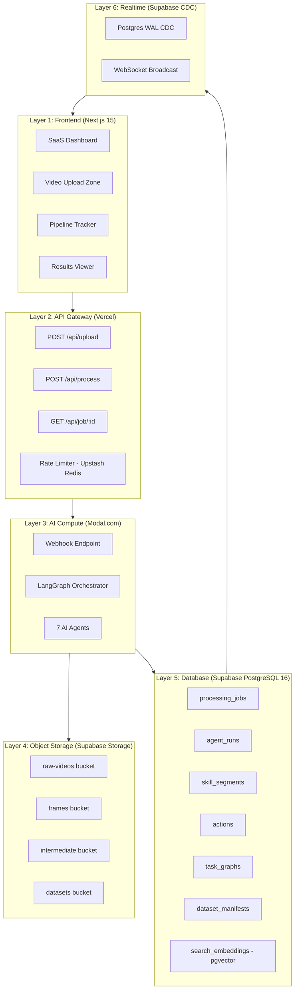
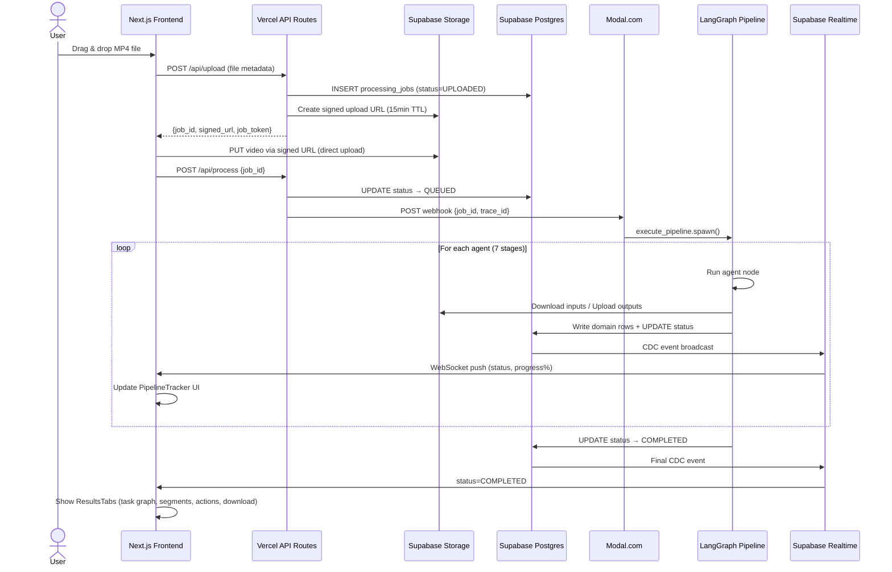
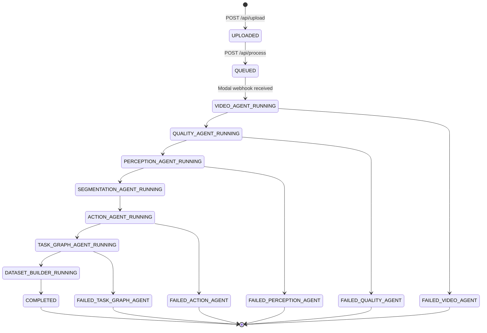
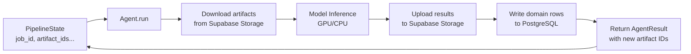
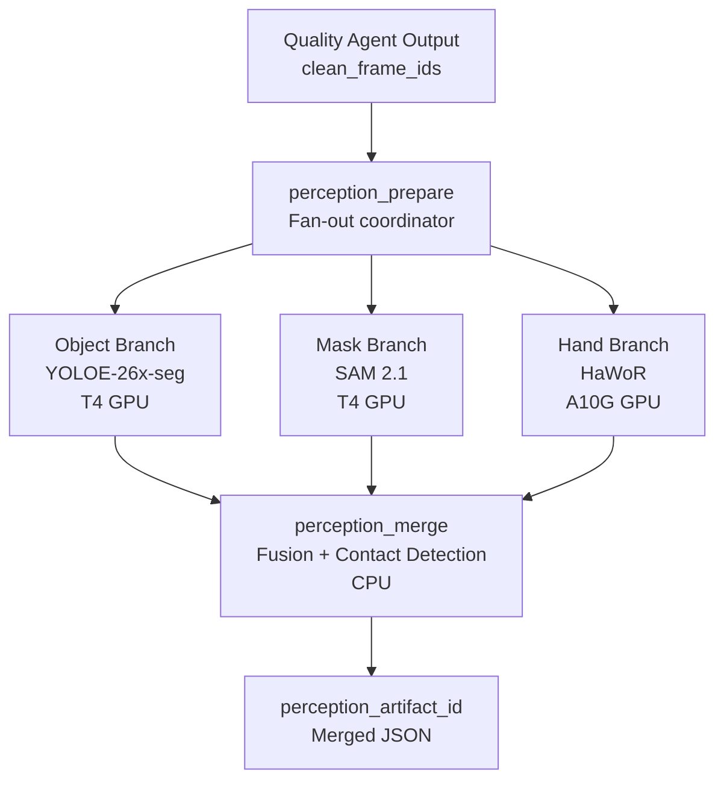
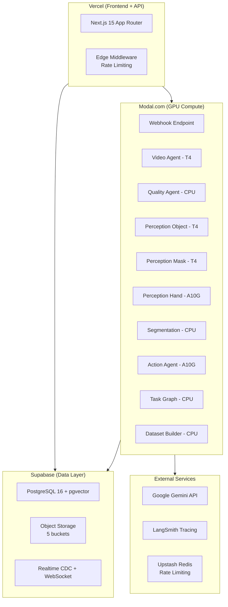
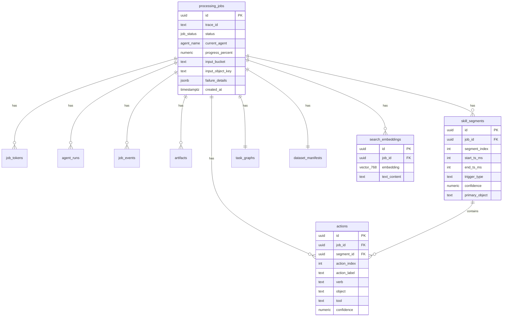

# 🚀 AutoEgoLab v3.0 — Complete Interview Guide

> **How to use:** Read this top-to-bottom. It's structured exactly like you'd explain the project to the founders. Start with problem ➔ why you're better ➔ architecture ➔ pipeline walkthrough ➔ deep agent dives ➔ deployment ➔ Q&A.

---

# Part 1: The Problem (Existing Flow)

## 1.1 How Robotic Training Data Is Made Today

Today, if a company wants to teach a robot arm to "pick up a screwdriver and tighten a bolt," they use one of three painful methods:

| Method | How It Works | Cost | Time | Quality |
|---|---|---|---|---|
| **Teleoperation** | A human wears a haptic suit and physically controls the robot arm while cameras record every movement. | $150–300/hour for operator + robot rental | 1 task = 30–60 min of teleoperation per demonstration | High quality, but extremely slow to scale |
| **Kinesthetic Teaching** | A human physically moves the robot's arm through the desired motion while the robot records joint angles. | Robot + engineer time | Same — one demo at a time | Low diversity — always the same trajectory |
| **Manual Frame Annotation** | Record a human doing the task, then hire annotators to label every frame: bounding boxes, object names, action labels. | $10–30/frame × thousands of frames | Weeks for a 5-min video | Inconsistent, error-prone, doesn't scale |

### The Core Bottleneck
All three approaches share the same fatal flaw: **linear scaling**. To get 10× more training data, you need 10× more human time. This means robot training datasets are tiny, expensive, and slow to create — which is why general-purpose robots still can't generalize across tasks.

## 1.2 What About Zero-Shot VLMs?

Some recent papers try to skip annotation entirely by feeding raw video into large Vision-Language Models (GPT-4o, Gemini Ultra) and asking: *"What actions are being performed?"*

**Why they fail:**
1. **No pixel precision.** VLMs output text, not pixel masks or 3D coordinates. You can't train a robot policy with "the person is holding something."
2. **Hallucination.** Monolithic VLMs confidently generate wrong action sequences — especially for factory tasks they've never seen in training.
3. **No temporal grounding.** They can't tell you *when* an action starts and ends in the video timeline.
4. **No hand tracking.** Robotic imitation learning needs fingertip positions and contact points — VLMs don't output MANO parameters.

---

# Part 2: Why AutoEgoLab Is Better

## 2.1 The Core Insight

> **"Don't ask one model to do everything. Build a pipeline of specialists."**

AutoEgoLab takes a raw egocentric factory video and produces a complete **VLA (Vision-Language-Action) training dataset** with:
- ✅ Pixel-precise object segmentation masks (SAM 2.1)
- ✅ 3D hand mesh poses with contact detection (HaWoR + MANO)
- ✅ Temporal skill boundaries with confidence scores
- ✅ Structured action labels: `{verb, object, tool, target}`
- ✅ Hierarchical Task Graph (subtasks → goals)
- ✅ Downloadable dataset in JSON + RLDS format

**All fully automated. Zero human annotation. Under 5 minutes.**

## 2.2 Key Differentiators



| Dimension | Existing | AutoEgoLab |
|---|---|---|
| **Annotation** | Manual / VLM hallucination | 7-agent automated pipeline |
| **Object Tracking** | 2D bounding boxes | Pixel-level masks (SAM 2.1) with temporal tracking |
| **Hand Pose** | None or 2D keypoints | Full 3D mesh via MANO parametric model (HaWoR) |
| **Action Labels** | Free-text VLM output | Structured `{verb, object, tool, target}` with confidence |
| **Task Structure** | Flat list | Hierarchical DAG (subtask groupings + causal edges) |
| **Speed** | Hours/days | ~2.5 minutes (p50) |
| **Scalability** | Linear with humans | Serverless GPU auto-scaling on Modal |

---

# Part 3: System Architecture

## 3.1 The 6-Layer Architecture



### Technology Choice Justification

| Component | Choice | Why Not The Alternative? |
|---|---|---|
| **Orchestration** | LangGraph 0.3 | Celery = dumb message queue, no stateful branching. Airflow = heavy infra overhead, designed for batch ETL not real-time AI. |
| **GPU Compute** | Modal.com | AWS Lambda = no GPU support. K8s = cold starts take 60s+ with Docker layer loading. Modal = <3s warm start with pre-cached model images. |
| **Database** | Supabase PostgreSQL | Firebase = no pgvector, no SQL. Plain Postgres = no built-in Realtime CDC or Storage. |
| **Realtime** | Supabase CDC | Polling = wasteful. Custom WebSocket server = maintenance overhead. Supabase CDC = zero-config push from DB row changes. |
| **Frontend** | Next.js 15 App Router | React SPA = no SSR/SEO. Remix = less ecosystem. Next.js = Vercel-native, instant deploys, API routes built-in. |

---

# Part 4: The Complete Pipeline — Step by Step

*This is the single most important section for the interview. Walk through exactly what happens from video upload to final dataset.*

## 4.1 End-to-End Flow Diagram



## 4.2 Step-by-Step Walkthrough

### Step 1: User Uploads Video
- User drags MP4 onto the `UploadZone` component
- Client-side validation: must be `.mp4`, max 300MB
- Browser calls `POST /api/upload` with file metadata (name, size, sha256)

### Step 2: Job Initialization (API)
- API creates a `processing_jobs` row with status `UPLOADED`
- Mints a **job-scoped access token** (HMAC-SHA256 signed, 24h TTL)
- Generates a **Supabase Storage signed upload URL** (15min TTL)
- Returns `{job_id, job_token, signed_url}` to browser

### Step 3: Direct Upload to Storage
- Browser PUTs the raw MP4 directly to Supabase Storage via the signed URL
- **Critical design:** Video bytes never touch Vercel servers → bypasses Vercel's 4.5MB body limit
- XHR progress events drive the upload progress bar

### Step 4: Pipeline Trigger
- Browser calls `POST /api/process {job_id}` with bearer token
- API validates the token, transitions job to `QUEUED`
- API sends webhook to Modal with `{job_id, trace_id}`
- **Idempotent:** If called twice, second call returns 202 with current status (no double-trigger)

### Step 5: Modal Receives Webhook → LangGraph Starts
- Modal webhook validates the shared secret
- Calls `execute_pipeline.spawn(job_id, trace_id)` — runs asynchronously
- LangGraph graph compiled from `build_pipeline_graph()` begins execution

### Step 6: Each Agent Executes (7 stages → detailed in Part 5)
- Each agent follows the pattern:
  1. Write `agent_runs` row (status=RUNNING)
  2. Update `processing_jobs.status` to `{AGENT}_RUNNING`
  3. Download input artifacts from Storage by UUID
  4. Run model inference
  5. Upload output artifacts to Storage
  6. Write domain rows (segments/actions/task_graphs)
  7. Update `agent_runs` to SUCCEEDED
  8. Merge new artifact IDs into PipelineState

### Step 7: Realtime Updates Push to Browser
- Every `processing_jobs` UPDATE triggers Supabase CDC
- Browser subscribed via WebSocket channel `job:{jobId}`
- PipelineTracker component maps status → progress bar + step indicators

### Step 8: Results Available
- Job reaches `COMPLETED` → UI renders:
  - **Task Graph Viewer** (interactive DAG via React Flow)
  - **Skill Segments Table** (timestamps, objects, confidence)
  - **Action Timeline** (verb/object/tool/target per segment)
  - **Download Panel** (dataset.json + dataset.rlds signed URLs)
  - **Semantic Search** (query actions via pgvector cosine similarity)

---

## 4.3 Job State Machine (FSM)



---

# Part 5: The 7 AI Agents — Deep Technical Dive

## 5.0 The Shared Agent Interface

Every agent extends `BaseAgent` and implements `run(state) → AgentResult`. Key design:
- Agents **never pass raw bytes** through LangGraph state — only UUID artifact references
- Each agent downloads what it needs, processes, uploads results, returns updated state keys
- This prevents 500MB+ serialized state objects from crashing the pipeline



---

## 5.1 Agent 1: Video Agent

### What It Does
Decodes raw MP4 → extracts sampled frames → computes visual embeddings → selects the most diverse keyframes via clustering.

### The Model: DINOv2 (Meta, Self-Supervised ViT)
- **Architecture:** Vision Transformer (ViT-B/14) with 86M parameters
- **Training:** Self-supervised via DINO objective — teacher-student contrastive learning on 142M images, **no human labels**
- **What it learns:** Dense visual features encoding spatial structure, object boundaries, depth cues — NOT classification labels
- **Output:** 768-dimensional embedding vector per frame

### Why DINOv2?
- Standard classifiers (ResNet, EfficientNet) map everything to class logits. DINOv2 preserves **structural semantics** — two frames showing the same scene from slightly different angles will have similar embeddings, but two frames showing different actions will have distant embeddings.
- This makes it perfect for **redundancy detection**: if 15 consecutive frames have nearly identical DINOv2 embeddings, we only need one of them.

### Why K-Medoids (not K-Means)?
- K-Means computes centroids that are mathematical averages — you get synthetic "average frames" that don't exist in the video
- **K-Medoids picks actual frames as cluster centers (medoids)** — guaranteed to be real, representative frames
- Uses cosine distance in the 768-dim DINOv2 space

### Pipeline Steps

```
Raw MP4 → ffprobe validation → ffmpeg frame extraction (1 FPS)
    → DINOv2 batch inference (batch=32, T4 GPU) → 768-dim embeddings
    → K-Medoids clustering (cosine metric) → ~30 keyframes/min
    → Upload each keyframe to Supabase Storage as artifact
    → Return raw_frame_artifact_ids[] to state
```

| Metric | Value |
|---|---|
| **Hardware** | T4 GPU (16GB VRAM) |
| **Runtime** | p50: 12s, p95: 25s |
| **Input** | 1 MP4 (max 360s, max 300MB) |
| **Output** | ~30–150 keyframe artifacts |

---

## 5.2 Agent 2: Quality Agent

### What It Does
Filters out frames that would corrupt downstream perception: blurry, too dark, or overexposed.

### The Techniques (Pure OpenCV, No ML)

| Filter | Method | Threshold | Why |
|---|---|---|---|
| **Blur** | Laplacian variance | ≥ 100 | Laplacian operator emphasizes high-frequency edges. Sharp image = high variance. Blurry = low. |
| **Underlit** | Mean grayscale intensity | ≥ 20 | YOLOE and HaWoR fail silently on near-black frames — their confidence scores are confidently wrong. |
| **Overlit** | Mean grayscale intensity | ≤ 235 | Blown highlights destroy object boundaries near windows or reflective surfaces. |
| **Overexposed** | % pixels > 250 in any channel | ≤ 15% | Partial overexposure corrupts SAM mask edges. |

### Why No ML Model for Quality?
- Deterministic computer vision filters are **100% reproducible** — same frame always gets same verdict
- No GPU needed → runs on CPU in ~4 seconds
- ML-based quality models would add complexity with marginal benefit for factory footage

| Metric | Value |
|---|---|
| **Hardware** | CPU only |
| **Runtime** | p50: 4s, p95: 8s |
| **Output** | `clean_frame_artifact_ids[]` (promotes artifact_type from RAW_FRAME → CLEAN_FRAME) |

---

## 5.3 Agent 3: Perception Agent (Parallel — 3 Branches)

This is the **most compute-intensive stage**. Three independent models run **in parallel** on separate GPU instances.

### Architecture: LangGraph Fan-Out / Fan-In



### Why 3 Separate Models Instead of One?
No single model does all three tasks well:
- **YOLOE** is the best open-source object detector for scene-level understanding
- **SAM 2.1** is the best video segmentation model with temporal consistency
- **HaWoR** is the only production-ready 3D hand recovery model for egocentric video

Running them as one model would require a custom multi-task architecture that doesn't exist yet.

### Why Parallel?
All three receive the same `clean_frame_artifact_ids[]` as input and produce independent outputs. Running sequentially wastes ~40% wall-clock time. LangGraph's fan-out/fan-in guarantees `perception_merge` only runs after **all three** complete.

---

### Branch A: Object Detection — YOLOE-26x-seg

- **Architecture:** Anchor-free, single-stage detector with instance segmentation head
- **What it outputs per frame:** List of `{class, confidence, bbox[x1,y1,x2,y2], mask_rle}`
- **Why YOLOE:** Real-time inference on T4 GPUs. Handles 80+ COCO classes + factory objects. Provides both bounding boxes AND pixel-level masks.
- **Hardware:** T4 GPU | **Runtime:** p50: 25s

### Branch B: Temporal Mask Tracking — SAM 2.1 (Segment Anything Model 2.1)

- **Architecture:** Promptable segmentation backbone + **Memory Bank** mechanism
  - Unlike frame-by-frame segmentation, SAM 2.1 maintains a **memory buffer** that tracks mask identity across frames
  - Even if an object is briefly occluded, the memory bank preserves its mask ID
- **What it outputs:** Per-frame mask data with consistent object IDs and mask areas
- **Why SAM 2.1:** Standard detectors "reset" every frame. SAM 2.1 provides **temporally consistent** mask tracking — essential for knowing that "object #3 in frame 1" is the same as "object #3 in frame 50."
- **Hardware:** T4 GPU | **Runtime:** p50: 35s

### Branch C: 3D Hand Pose — HaWoR (Hand-centric World Reconstruction)

- **Architecture:** Uses **MANO** — a parametric statistical model of the human hand
  - MANO represents a hand as: **pose parameters** (51 dims: 3 global rotation + 15 joints × 3 axes) + **shape parameters** (10 dims)
  - From these parameters, a full 778-vertex 3D mesh can be reconstructed
- **What it outputs per frame:** `{hand_side, mano_pose[51], wrist_3d[3], fingertip_3d[5,3], contact_probability, keypoints_2d[21,2]}`
- **Why HaWoR over MediaPipe/OpenPose:**
  - MediaPipe/OpenPose are trained on **frontal camera views** (selfies, webcams)
  - Factory videos are **egocentric** — looking down at hands from first-person view
  - HaWoR is specifically designed for egocentric hand reconstruction, handling self-occlusion and tool-holding poses
- **Hardware:** A10G GPU (24GB VRAM — HaWoR is more memory-intensive) | **Runtime:** p50: 30s

### Merge Node: Fusion + Contact Heuristic

After all three branches complete, the merge node:
1. **Aligns data by frame** — builds per-frame `PerceptionFrame` objects combining objects, masks, and hands
2. **Computes contact events:** Where a hand's 2D keypoint bounding box overlaps with an object's pixel mask with IoU > 0.15 AND the hand's contact_probability > 0.5 → **contact logged**
3. Uploads merged JSON → returns `perception_artifact_id`

| Metric | Value |
|---|---|
| **Total Runtime (parallel)** | p50: ~40s, p95: ~75s (bounded by slowest branch) |

---

## 5.4 Agent 4: Segmentation Agent

### What It Does
Converts the continuous perception stream into **discrete atomic skill segments** with precise timestamps.

### The Algorithm: Dual-Signal Boundary Detection (Pure Math, No ML)

**Signal 1 — Mask Delta (Jaccard Distance):**
- For each pair of consecutive frames, compute the Jaccard distance of their mask sets
- If mask composition changes significantly (threshold: 0.15) → **boundary candidate**
- Smoothed with 5-frame rolling average to reduce noise

**Signal 2 — Contact Transitions:**
- Track binary contact state (any hand touching any object? 0/1)
- Apply hysteresis window (3 frames) to filter noise
- Rising edges (0→1) and falling edges (1→0) → **boundary candidates**

**Fusion:** Union of both signal boundaries → merge segments shorter than 1500ms into previous

### Why Deterministic Instead of ML?
- Contact events from HaWoR + mask changes from SAM 2.1 are already **strong, validated signals**
- A learned segmentation model would add latency, GPU cost, and potential hallucination
- Deterministic = 100% reproducible, debuggable, and explainable

| Metric | Value |
|---|---|
| **Hardware** | CPU only (NumPy signal processing) |
| **Runtime** | p50: 8s |
| **Output** | `segment_ids[]` written to `skill_segments` table |

---

## 5.5 Agent 5: Action Agent

### What It Does
Maps each skill segment to a structured action record: `{verb, object, tool, target, confidence}`.

### Primary Model: EgoVLM-3B
- **Architecture:** Vision-Language Model (3B parameters) fine-tuned on **Ego4D** dataset
- **Ego4D:** Meta's massive egocentric video dataset — 3,670 hours of first-person video with structured activity annotations
- **Why EgoVLM over GPT-4V/Gemini:** General VLMs say "a person is manipulating something." EgoVLM understands factory action taxonomy: `{verb: "tighten", object: "bolt", tool: "wrench", target: "bracket"}`
- **Input:** 4 representative frames from the skill segment + structured prompt
- **Output:** JSON with `{action_label, verb, object, tool, target, confidence}`

### Fallback: Gemini 3.1 Pro (Confidence-Gated)
- If EgoVLM confidence < 0.40 → triggers Gemini fallback with `instructor` for structured output
- If > 50% of segments produce "unknown" actions → `FAILED_ACTION_AGENT`

| Metric | Value |
|---|---|
| **Hardware** | A10G GPU (EgoVLM-3B needs ~6GB VRAM in bfloat16) |
| **Runtime** | p50: 28s, p95: 60s |
| **Output** | `action_ids[]` written to `actions` table |

---

## 5.6 Agent 6: Task Graph Agent

### What It Does
Takes the ordered sequence of action records and builds a **hierarchical Directed Acyclic Graph (DAG)** — grouping atomic actions into subtasks and identifying the overall goal.

### Why Gemini With Deep Thinking?
This is the only stage requiring **semantic reasoning**, not pattern recognition:
- "grasp bolt" + "position bolt" + "tighten bolt" = **"Install bolt" subtask**
- Understanding prerequisite relationships: "position bracket" must precede "tighten bolt"
- Inferring the high-level goal from the action sequence

Gemini 3.1 Pro with `thinking_budget=4096` allows the model multi-step causal reasoning over the action timeline.

### Output Schema
```json
{
  "goal": "Assemble motor bracket assembly",
  "nodes": [
    {"id": "goal_0", "type": "goal", "label": "Assemble motor bracket"},
    {"id": "subtask_1", "type": "subtask", "label": "Prepare components"},
    {"id": "action_0", "type": "action", "label": "grasp screwdriver from tray"}
  ],
  "edges": [
    {"from": "goal_0", "to": "subtask_1", "relation": "has_subtask"},
    {"from": "subtask_1", "to": "action_0", "relation": "has_subtask"}
  ]
}
```

### Fallback: Deterministic Template Graph
If Gemini fails after 3 retries → builds a simple linear chain graph (action1 → action2 → ...) with root node "Unknown Task."

| Metric | Value |
|---|---|
| **Hardware** | External API (network-bound) |
| **Runtime** | p50: 18s, p95: 40s |
| **Output** | `task_graph_id` written to `task_graphs` table |

---

## 5.7 Agent 7: Dataset Builder

### What It Does
Final compilation. Loads all upstream outputs, validates with Pydantic, assembles into:
- **dataset.json** — Human-readable structured VLA records
- **dataset.rlds** — TensorFlow Records format for direct robot policy training

Each VLA record contains:
```
{record_index, observation_image_artifact_id, language_instruction,
 action_verb, action_object, action_tool, action_target,
 timestamp_start_ms, timestamp_end_ms, confidence, model_used}
```

| Metric | Value |
|---|---|
| **Hardware** | CPU (JSON serialization + file I/O) |
| **Runtime** | p50: 4s |
| **Output** | `dataset_manifest_id` in `dataset_manifests` table |

---

# Part 6: Cloud Deployment & Infrastructure

## 6.1 Deployment Topology



## 6.2 Modal GPU Allocation Map

| Agent | GPU | VRAM | Memory | Timeout | Pre-cached Model |
|---|---|---|---|---|---|
| Video Agent | T4 | 16GB | 12GB | 120s | DINOv2 ViT-B/14 (~350MB) |
| Quality Agent | CPU | — | 4GB | 60s | — |
| Perception Object | T4 | 16GB | 12GB | 240s | YOLOE-26x-seg (~200MB) |
| Perception Mask | T4 | 16GB | 12GB | 240s | SAM 2.1 Hiera Large (~2.4GB) |
| Perception Hand | **A10G** | **24GB** | 20GB | 240s | HaWoR checkpoint (~1.5GB) |
| Segmentation | CPU | — | 4GB | 60s | — |
| Action Agent | **A10G** | **24GB** | 20GB | 180s | EgoVLM-3B (~6GB in bf16) |
| Task Graph | CPU | — | 4GB | 120s | — |
| Dataset Builder | CPU | — | 4GB | 60s | — |

### Why Modal Over K8s/Lambda?
- **Model pre-caching:** Modal images bake model weights at build time → warm start in <3s
- **Fractional GPU billing:** Pay per second of GPU use, not for idle cluster time
- **Serverless scale:** 0 → N containers automatically, no cluster management
- **Native Python:** Define GPU requirements as decorators, not YAML manifests

## 6.3 Estimated Pipeline Runtime

```
init_job                   ~0.5s
video_agent               ~12s   (T4, DINOv2)
quality_agent              ~4s   (CPU)
perception_prepare         ~0.2s
  ├── object_branch        ~25s  (T4, YOLOE)     ─┐
  ├── mask_branch          ~35s  (T4, SAM 2.1)    ─┤ parallel = ~35s
  └── hand_branch          ~30s  (A10G, HaWoR)   ─┘
perception_merge            ~5s  (CPU)
segmentation_agent          ~8s  (CPU)
action_agent               ~28s  (A10G, EgoVLM)
task_graph_agent           ~18s  (Gemini API)
dataset_builder             ~4s  (CPU)
finalize                    ~0.5s
────────────────────────────────────────
TOTAL p50:               ~120s  (2 minutes)
TOTAL p95:               ~300s  (5 minutes)
```

---

# Part 7: Database Schema (Key Tables)



### Key Design Decisions
- **RLS (Row Level Security):** All tables have `deny_all` policies for anon/authenticated. All access goes through `service_role` key (server-side only).
- **pgvector:** `search_embeddings` uses IVFFlat index for cosine similarity search — enables semantic skill search across datasets.
- **Realtime publication:** `processing_jobs`, `agent_runs`, and `job_events` are published to Supabase Realtime for live UI updates.

---

# Part 8: Fault Tolerance & Recovery

## 8.1 Retry Logic
Every agent wrapped with `tenacity` retry:
- **Retryable errors:** Network timeouts, Supabase 503, Gemini 429, CUDA OOM
- **Strategy:** Exponential backoff with jitter (base=2s, max=30s, 3 attempts)
- **CUDA OOM recovery:** Automatically halves batch size and retries

## 8.2 Heartbeat Watchdog
- Scheduled Modal function runs every 60s
- Detects "stuck" jobs (no `updated_at` change for 180s)
- Attempts resume from last checkpoint, or marks `FAILED_ORCHESTRATOR`

## 8.3 Checkpoint-Based Recovery
- Each agent writes checkpoint data to `processing_jobs.failure_details.checkpoints`
- On resume: `build_resume_state()` reconstructs PipelineState from completed checkpoints
- Pipeline resumes from failed stage, not from scratch

## 8.4 Edge Case Matrix

| Scenario | Detection | Response |
|---|---|---|
| **Video is all dark** | Quality Agent: all frames brightness < 20 | `FAILED_QUALITY_AGENT` |
| **Hands occluded >60%** | HaWoR: no detections in most frames | Segmentation falls back to mask-delta only (degraded mode) |
| **No objects detected** | YOLOE: zero detections above 0.5 | One FALLBACK segment spanning full timeline |
| **VLM hallucinates** | EgoVLM confidence < 0.40 | Gemini 3.1 Pro fallback |
| **SAM 2.1 OOM** | CUDA OOM exception | Batch size halved, retry; 2nd OOM → `FAILED_PERCEPTION_AGENT` |
| **Gemini returns bad JSON** | `instructor` parser fails | 2 automatic validation retries; 3rd fail → template graph |
| **Browser disconnects** | — | User reopens page → fetches current status → re-subscribes to Realtime |
| **Double-click process** | Job already QUEUED | Returns 202, no re-trigger (optimistic lock) |

---

# Part 9: Project File Structure

```
autoegolab/
├── app/                          # Next.js 15 App Router
│   ├── page.tsx                  # Landing page (/)
│   ├── demo/page.tsx             # Demo page (/demo) — upload + pipeline tracker
│   ├── library/page.tsx          # Library page (/library) — past jobs browser
│   └── api/                      # API Routes (server-side)
│       ├── upload/route.ts       # POST — job init + signed URL
│       ├── process/route.ts      # POST — trigger Modal webhook
│       ├── search/route.ts       # POST — pgvector semantic search
│       └── job/[id]/
│           ├── route.ts          # GET — job status + details
│           ├── dataset/route.ts  # GET — signed download URLs
│           └── task-graph/route.ts  # GET — task graph JSON
│
├── components/                   # React Components
│   ├── landing/                  # Landing page sections
│   ├── demo/                     # Demo page components
│   │   ├── UploadZone.tsx        # Drag-drop upload with validation
│   │   ├── PipelineTracker.tsx   # Real-time 7-step progress tracker
│   │   └── ResultsTabs.tsx       # Task graph, segments, actions viewer
│   └── library/                  # Library page components
│
├── lib/                          # Shared utilities
│   ├── supabase/                 # Supabase client factories
│   ├── api/upload.ts             # Client-side upload logic (XHR + progress)
│   └── realtime/subscribe.ts    # WebSocket subscription helper
│
├── types/                        # TypeScript types
│   └── database.ts               # Auto-generated from Supabase schema
│
├── modal_backend/                # Python AI Pipeline (deployed to Modal)
│   ├── app.py                    # Modal app definition + webhook + GPU specs
│   ├── pipeline.py               # LangGraph graph assembly + execution
│   ├── config.py                 # Tunable parameters (thresholds, timeouts)
│   ├── schema.py                 # PipelineState TypedDict
│   └── agents/                   # 7 Agent implementations
│       ├── base.py               # BaseAgent ABC + artifact helpers
│       ├── video.py              # Agent 1: DINOv2 + K-Medoids
│       ├── quality.py            # Agent 2: Laplacian + brightness filters
│       ├── perception_object.py  # Agent 3A: YOLOE-26x-seg
│       ├── perception_mask.py    # Agent 3B: SAM 2.1
│       ├── perception_hand.py    # Agent 3C: HaWoR
│       ├── perception_merge.py   # Agent 3 Merge: fusion + contact detection
│       ├── segmentation.py       # Agent 4: dual-signal boundary detection
│       ├── action.py             # Agent 5: EgoVLM-3B + Gemini fallback
│       ├── task_graph.py         # Agent 6: Gemini deep think
│       └── dataset_builder.py    # Agent 7: Pydantic validation + RLDS export
│
└── docs/                         # Technical documentation
    └── technical_components/     # 19 detailed spec documents
```

---

# Part 10: 🔥 Predicted Interview Questions & Answers

## Architecture Questions

### Q: "Walk me through what happens when a user uploads a video."
**A:** *(Use Part 4 Step-by-Step Walkthrough — hit all 8 steps)*

### Q: "Why did you use a multi-agent pipeline instead of just calling GPT-4o?"
**A:** Specialization over generalization. A single VLM trying to simultaneously segment objects, track 3D hand poses, and label actions will fail at all of them due to compounding errors. Our pipeline assigns best-in-class models to each modality: SAM 2.1 for masks, HaWoR for hands, EgoVLM for action labels. Each agent receives validated, high-quality input from its predecessor.

### Q: "Why LangGraph instead of Celery or Airflow?"
**A:** Three reasons: (1) **Stateful branching** — LangGraph natively supports fan-out/fan-in for our parallel perception stage. Celery only does flat task queues. (2) **Typed state** — PipelineState is a TypedDict that flows through the graph, making data contracts between agents explicit. (3) **Built-in checkpointing** — enables resume from any stage. Airflow would work but is designed for batch ETL, not real-time AI pipelines.

### Q: "Why Modal instead of AWS Lambda or Kubernetes?"
**A:** Lambda doesn't support GPUs. Kubernetes clusters have 60+ second cold starts due to Docker layer loading + model downloads. Modal pre-bakes model weights into container images at build time, giving <3 second warm starts. Plus Modal's fractional GPU billing means we only pay per-second of actual GPU use, not for idle cluster time.

### Q: "How do you handle the video never touching your Vercel servers?"
**A:** The upload API generates a Supabase Storage signed upload URL. The browser PUTs the video directly to Supabase Storage via that signed URL. The bytes never pass through Vercel, which would hit their 4.5MB body limit anyway. We get progress events from XHR for the upload bar.

---

## Agent-Specific Questions

### Q: "Why DINOv2 for keyframe selection?"
**A:** DINOv2 is trained self-supervised — it learns pure visual structure without classification bias. This means its embeddings encode scene composition and spatial layout, not just "is this a hammer?" K-Medoids clustering in this embedding space selects frames that are maximally visually different from each other, guaranteeing we discard static redundancy while preserving temporal diversity.

### Q: "Why not just sample every Nth frame?"
**A:** Uniform sampling misses important moments and includes redundant static poses. If a worker holds a tool motionless for 10 seconds, uniform sampling gives you 10 identical frames. DINOv2 + K-Medoids gives you 1 frame from that static period and allocates the remaining budget to frames where actual action changes occur.

### Q: "What does SAM 2.1's memory bank actually do?"
**A:** Standard segmentation runs independently per frame — if an object is briefly occluded, it loses its identity. SAM 2.1 maintains a memory bank that stores mask embeddings from previous frames. When an object reappears after occlusion, the memory bank matches it to the stored embedding, preserving its mask ID. This gives us temporally consistent tracking without explicit object IDs from a tracker.

### Q: "Why HaWoR over MediaPipe Hands?"
**A:** MediaPipe is trained on frontal views (selfies, webcams). In egocentric factory video, you're looking down at your own hands — fingers overlap, tools occlude joints, and motion blur is severe. HaWoR uses the MANO parametric model to reconstruct full 3D hand meshes even under heavy self-occlusion. It outputs 51-dimensional pose parameters + 3D fingertip coordinates, which MediaPipe can't provide.

### Q: "How does your contact detection work?"
**A:** It's a geometric heuristic in the perception merge node. For each frame, we check: (1) Does HaWoR report contact_probability > 0.5? (2) Does the 2D bounding box of the hand's keypoints overlap with any YOLOE object mask with IoU > 0.15? If both conditions are true, we log a contact event `{hand_side, object_class, iou}`. The segmentation agent then uses these contact transitions as one of two boundary signals.

---

## Systems Design Questions

### Q: "How do you prevent the LangGraph state from becoming a memory bomb?"
**A:** Agents NEVER pass raw image bytes through state. The PipelineState only carries lightweight UUID strings — artifact IDs referencing Supabase Storage. A 300-frame 1080p video would need ~500MB in state. Instead, agents download what they need at execution start and upload results at the end. State stays under 1KB regardless of video length.

### Q: "How does realtime work?"
**A:** Every agent updates the `processing_jobs` row status. PostgreSQL's WAL (Write-Ahead Log) captures these changes. Supabase Realtime's CDC (Change Data Capture) publishes them over WebSocket to any browser subscribed with `filter: id=eq.{jobId}`. The frontend's PipelineTracker maps status strings to progress percentages. We also have a fallback polling mechanism if the WebSocket disconnects.

### Q: "What happens if an agent crashes mid-execution?"
**A:** Three layers of defense: (1) **tenacity retries** — transient errors get 3 attempts with exponential backoff. (2) **Heartbeat watchdog** — a scheduled function checks every 60s for jobs stuck without an `updated_at` change for 180s. (3) **Checkpoint recovery** — each agent writes checkpoint data before transitioning. The watchdog can reconstruct PipelineState from checkpoints and resume the pipeline from the failed stage.

### Q: "What about GPU OOM errors?"
**A:** CUDA OOM is caught by the retry wrapper. On first OOM, the batch size is automatically halved and the operation retried. If the second attempt also OOMs, the agent is marked as failed. This handles variability in frame count / model memory usage without manual intervention.

### Q: "How do you handle idempotency for the process trigger?"
**A:** The `POST /api/process` endpoint uses an optimistic lock: `UPDATE processing_jobs SET status='QUEUED' WHERE id={jobId} AND status='UPLOADED'`. If the status is already QUEUED or RUNNING (from a previous call), the WHERE clause matches 0 rows, and we return 202 with the current status. No double-trigger possible.

---

## Scale & Performance Questions

### Q: "Can this handle multiple concurrent jobs?"
**A:** Each job runs as independent Modal containers with isolated GPU instances. Modal's concurrency limits can be scaled by increasing the GPU concurrency quota. The only shared resource is Supabase, which handles concurrent writes via PostgreSQL's MVCC. In the current free-tier setup, we target 1-2 concurrent jobs.

### Q: "What's the bottleneck?"
**A:** The perception stage (p50: 40s, p95: 75s). Specifically SAM 2.1 mask tracking on T4 — processing 100-150 frames through a 2.4GB model. We mitigate by running all three perception branches in parallel, so the total time is bounded by the slowest branch, not the sum.

### Q: "What would you change at 100x scale?"
**A:** Three things: (1) Add an admission queue (Upstash + Redis) to prevent GPU contention. (2) Use Modal's volume caching for intermediate artifacts instead of round-tripping to Supabase Storage. (3) Upgrade the IVFFlat index on search_embeddings to HNSW for sub-millisecond retrieval at millions of vectors.

---

> **Good luck, Naman! Remember: lead with the PROBLEM, then show HOW your system solves it, then go deep on the WHY behind each technical choice. The founders will be impressed by your depth on model selection rationale and fault tolerance design.** 🔥
